##additional no1```
CREATE TABLE student14 (
    student14_id   NUMBER(5) PRIMARY KEY,
    student14_name VARCHAR2(50),
    department   VARCHAR2(30),
    marks        NUMBER(5,2)
);
```
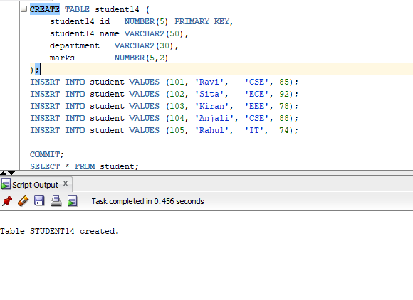
```
INSERT INTO student14 VALUES (101, 'Ravi',   'CSE', 85);
INSERT INTO student14 VALUES (102, 'Sita',   'ECE', 92);
INSERT INTO student14 VALUES (103, 'Kiran',  'EEE', 78);
INSERT INTO student14 VALUES (104, 'Anjali', 'CSE', 88);
INSERT INTO student14 VALUES (105, 'Rahul',  'IT',  74);


COMMIT;
```
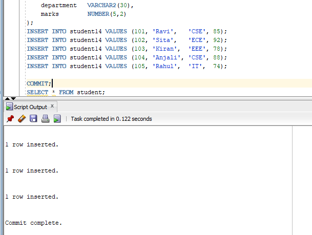

```
SELECT * FROM student14;
```
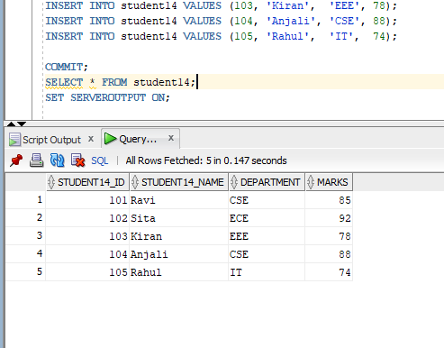

```
SET SERVEROUTPUT ON;

DECLARE
    v_student14_id   student14.student14_id%TYPE;
    v_student14_name student14.student14_name%TYPE;
    v_department   student14.department%TYPE;
    v_marks        student14.marks%TYPE;

BEGIN
    -- Accept Student14 ID from the user
 v_student14_id := &student14_id;

    -- Retrieve student14 details
    SELECT student14_name, department, marks
    INTO v_student14_name, v_department, v_marks
    FROM student14
    WHERE student14_id = v_student14_id;
```
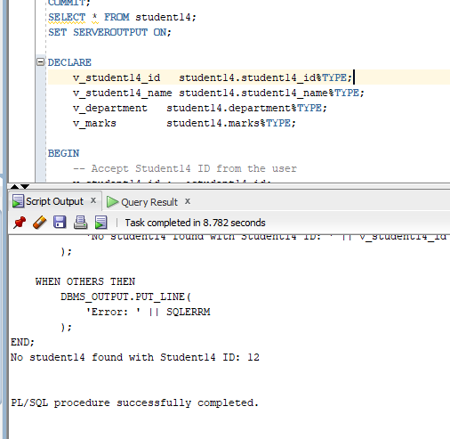

##additional no2```
CREATE TABLE employee14 (
    employee14_id   NUMBER(5) PRIMARY KEY,
    employee14_name VARCHAR2(50),
    department    VARCHAR2(30),
    monthly_salary NUMBER(10,2)
);
```
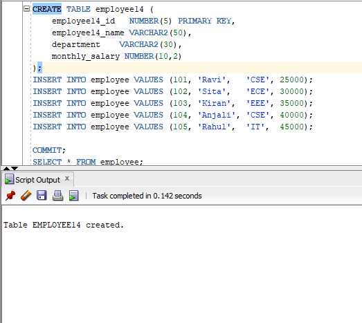

```
INSERT INTO employee14 VALUES (101, 'Ravi',   'CSE', 25000);
INSERT INTO employee14 VALUES (102, 'Sita',   'ECE', 30000);
INSERT INTO employee14 VALUES (103, 'Kiran',  'EEE', 35000);
INSERT INTO employee14 VALUES (104, 'Anjali', 'CSE', 40000);
INSERT INTO employee14 VALUES (105, 'Rahul',  'IT',  45000);

COMMIT;
```
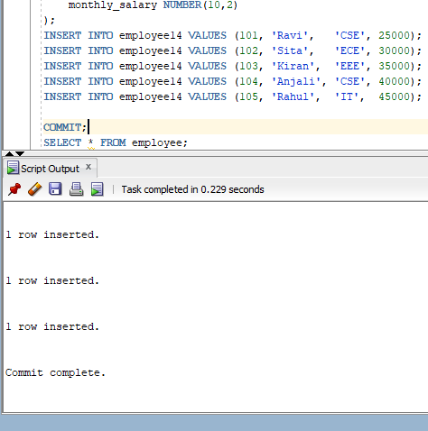

```
SELECT * FROM employee14;
```
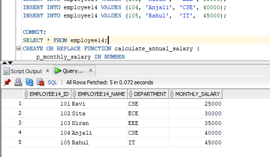
```
CREATE OR REPLACE FUNCTION calculate_annual_salary (
    p_monthly_salary IN NUMBER
)
RETURN NUMBER
IS
    v_annual_salary NUMBER;
BEGIN
    v_annual_salary := p_monthly_salary * 12;

    RETURN v_annual_salary;
END;
SELECT object_name, status
FROM user_objects
WHERE object_name = 'CALCULATE_ANNUAL_SALARY';

SELECT employee14_id,
       employee14_name,
       department,
       monthly_salary,
       calculate_annual_salary(monthly_salary) AS annual_salary
FROM employee14;
SET SERVEROUTPUT ON;

DECLARE
    v_monthly_salary employee14.monthly_salary%TYPE;
    v_annual_salary  NUMBER;
BEGIN
    SELECT monthly_salary
    INTO v_monthly_salary
    FROM employee14
    WHERE employee14_id = 101;

    
    v_annual_salary := calculate_annual_salary(v_monthly_salary);
 DBMS_OUTPUT.PUT_LINE('Employee ID     : 101');
    DBMS_OUTPUT.PUT_LINE('Monthly Salary  : ' || v_monthly_salary);
    DBMS_OUTPUT.PUT_LINE('Annual Salary   : ' || v_annual_salary);
END;

```
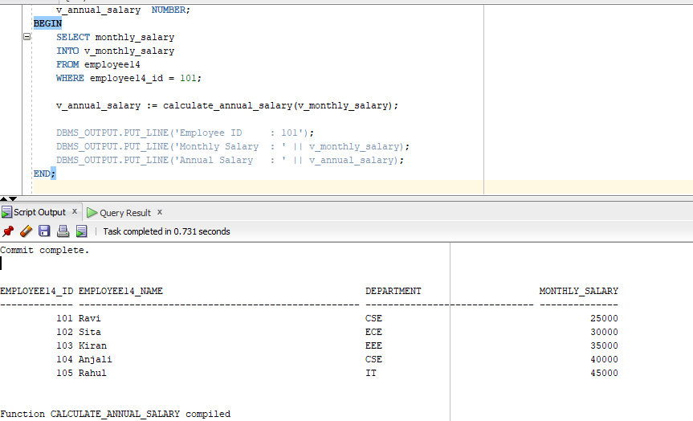

##additional no3```
CREATE TABLE employee14 (
    employee14_id   NUMBER(5) PRIMARY KEY,
    employee14_name VARCHAR2(50),
    department    VARCHAR2(30),
    monthly_salary NUMBER(10,2)
);
```
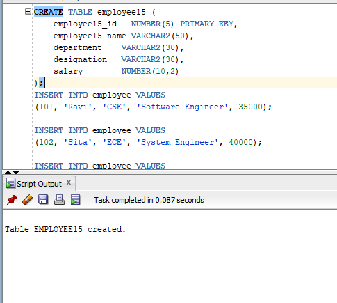

```
INSERT INTO employee15 VALUES
(101, 'Ravi', 'CSE', 'Software Engineer', 35000);

INSERT INTO employee15 VALUES
(102, 'Sita', 'ECE', 'System Engineer', 40000);

INSERT INTO employee VALUES
(103, 'Kiran', 'CSE', 'Senior Developer', 50000);

INSERT INTO employee VALUES
(104, 'Anjali', 'EEE', 'Electrical Engineer', 38000);

INSERT INTO employee VALUES
(105, 'Rahul', 'CSE', 'Software Engineer', 42000);
INSERT INTO employee VALUES
(106, 'Priya', 'ECE', 'Hardware Engineer', 45000);

INSERT INTO employee VALUES
(107, 'Arun', 'EEE', 'Design Engineer', 40000);

INSERT INTO employee VALUES
(108, 'Sneha', 'CSE', 'Project Engineer', 48000);

COMMIT;
```
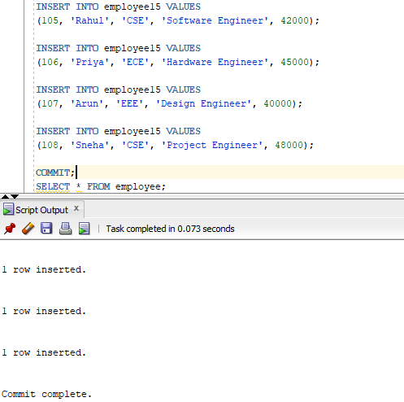

```
SELECT * FROM employee;
```
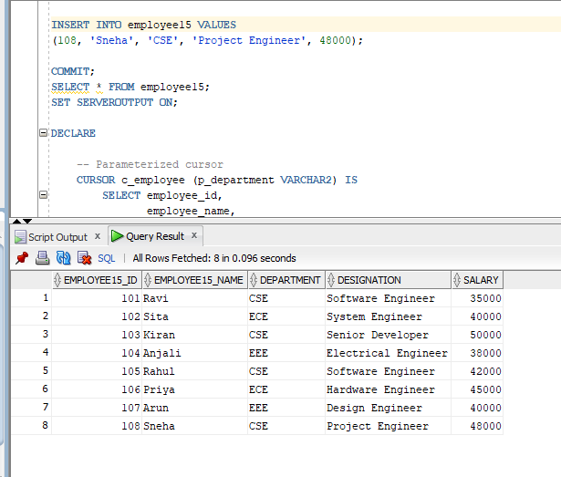

```
SET SERVEROUTPUT ON;

DECLARE

    -- Parameterized cursor
    CURSOR c_employee (p_department VARCHAR2) IS
        SELECT employee_id,
               employee_name,
               department,
               designation,
               salary
        FROM employee
        WHERE department = p_department;

    -- Variables to store employee details
  v_employee_id   employee.employee_id%TYPE;
    v_employee_name employee.employee_name%TYPE;
    v_department    employee.department%TYPE;
    v_designation   employee.designation%TYPE;
    v_salary        employee.salary%TYPE;

BEGIN

    -- Open cursor by passing department name
    OPEN c_employee('CSE');

    -- Fetch employee records
    LOOP

        FETCH c_employee
        INTO v_employee_id,
             v_employee_name,
             v_department,
             v_designation,
             v_salary;

```

