```
CREATE TABLE employee9 (
    employee9_id   NUMBER(6) PRIMARY KEY,
    employee9_name VARCHAR2(50),
    department    VARCHAR2(30),
    salary        NUMBER(10,2)
);
```
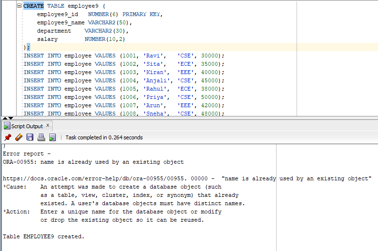
```
INSERT INTO employee9 VALUES (1001, 'Ravi',   'CSE', 30000);
INSERT INTO employee9 VALUES (1002, 'Sita',   'ECE', 35000);
INSERT INTO employee9 VALUES (1003, 'Kiran',  'EEE', 40000);
INSERT INTO employee9 VALUES (1004, 'Anjali', 'CSE', 45000);
INSERT INTO employee9 VALUES (1005, 'Rahul',  'ECE', 38000);
INSERT INTO employee9 VALUES (1006, 'Priya',  'CSE', 50000);
INSERT INTO employee9 VALUES (1007, 'Arun',   'EEE', 42000);
INSERT INTO employee9 VALUES (1008, 'Sneha',  'CSE', 48000);
INSERT INTO employee9 VALUES (1009, 'Vijay',  'ECE', 36000);
INSERT INTO employee9 VALUES (1010, 'Divya',  'CSE', 52000);

COMMIT;
```
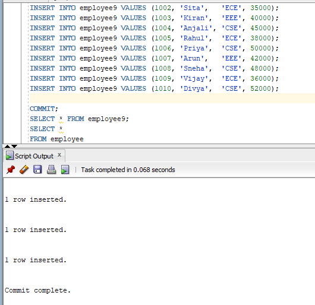

```
SELECT * FROM employee9;
```
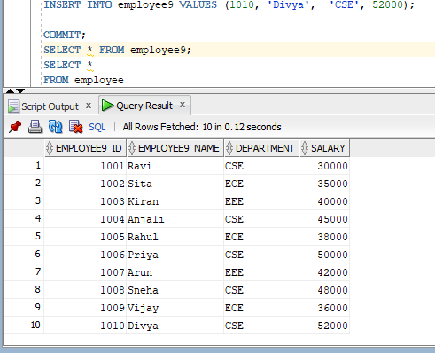

```
SELECT *
FROM employee9
WHERE employee9_name = 'Ravi';
```
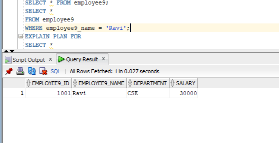

```
EXPLAIN PLAN FOR
SELECT *
FROM employee9
WHERE employee9_name = 'Ravi';

SELECT *
FROM TABLE(DBMS_XPLAN.DISPLAY);
CREATE INDEX idx_employee9_name
ON employee9(employee9_name);
SELECT *
FROM employee9
WHERE employee9_name = 'Ravi';
BEGIN
    DBMS_STATS.GATHER_TABLE_STATS(
        USER,
        'EMPLOYEE9'
    );
END;
/
EXPLAIN PLAN FOR
SELECT *
FROM employee
WHERE employee_name = 'Ravi';

SELECT *
FROM TABLE(DBMS_XPLAN.DISPLAY);S
DROP INDEX idx_employee9_name;
SELECT index_name
FROM user_indexes
WHERE index_name = 'IDX_EMPLOYEE9_NAME';
```
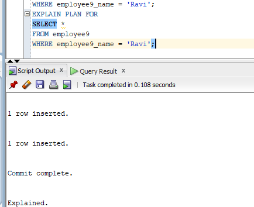
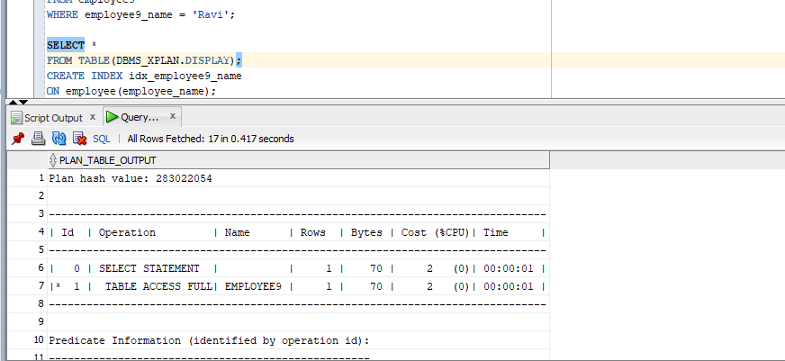
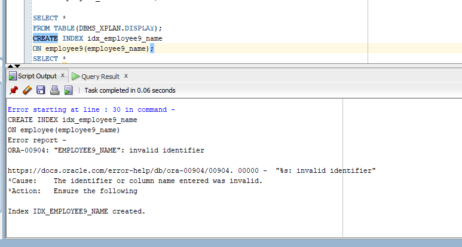
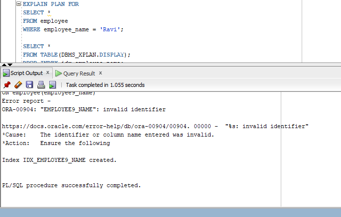
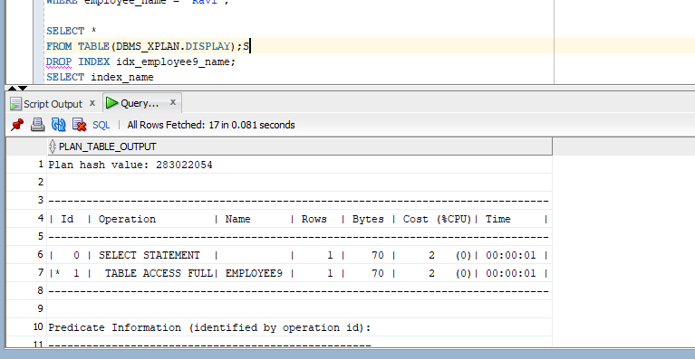
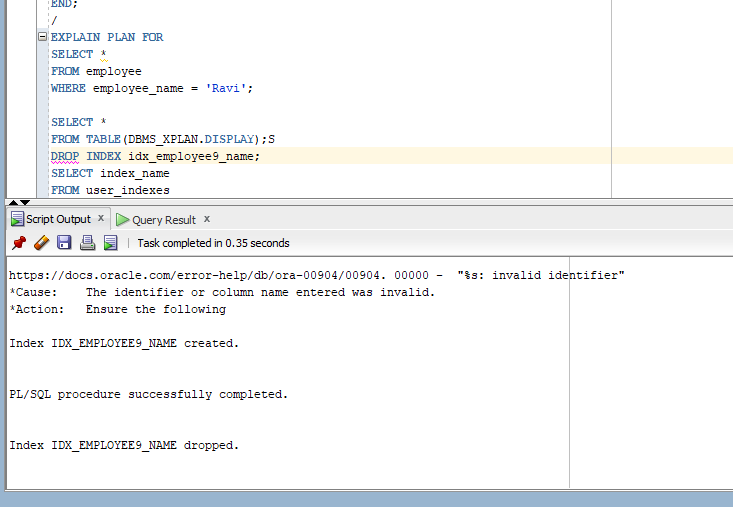
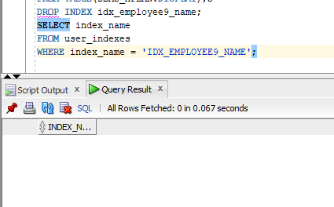
