##program no1```
CREATE TABLE student9 (
    student9_id   NUMBER(5) PRIMARY KEY,
    stude
Cnt9_name VARCHAR2(50),
    course       VARCHAR2(30),
    marks        NUMBER(5,2)
);
```
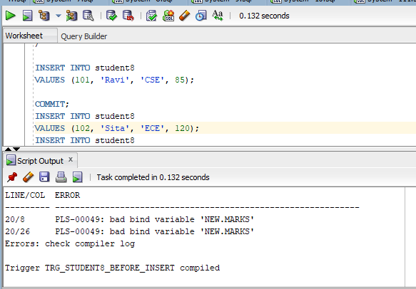
```
CREATE OR REPLACE TRIGGER trg_student8_before_insert
BEFORE INSERT ON student8
FOR EACH ROW
BEGIN

    -- Validate Student8 ID
    IF :NEW.student8_id <= 0 THEN
        RAISE_APPLICATION_ERROR(
            -20001,
            'Student8 ID must be greater than 0.'
        );
    END IF;

    -- Validate Student8 Name
    IF :NEW.student8_name IS NULL THEN
        RAISE_APPLICATION_ERROR(
            -20002,
            'Student8 Name cannot be NULL.'
        );
    END IF;

    -- Validate Marks
    IF :NEW.marks < 0 OR :NEW.marks > 100 THEN
        RAISE_APPLICATION_ERROR(
            -20003,
            'Marks must be between 0 and 100.'
        );
    END IF;

END;
/

INSERT INTO student8
VALUES (101, 'Ravi', 'CSE', 85);
COMMIT;
INSERT INTO student8
VALUES (102, 'Sita', 'ECE', 120);
INSERT INTO student8
VALUES (-103, 'Kiran', 'EEE', 75);

SELECT * FROM student8;
```
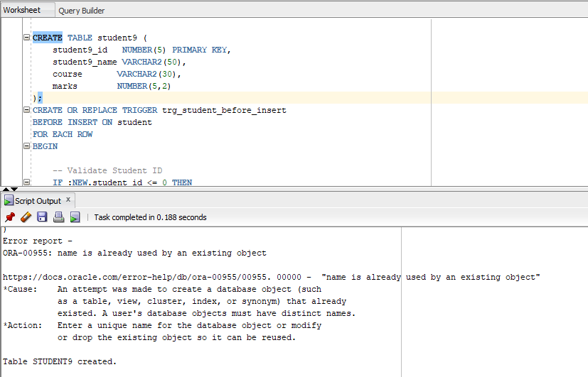

##program no2```
CREATE TABLE student10 (
    student10_id   NUMBER(5) PRIMARY KEY,
    student10_name VARCHAR2(50),
    course       VARCHAR2(30),
    marks        NUMBER(5,2)
);
```
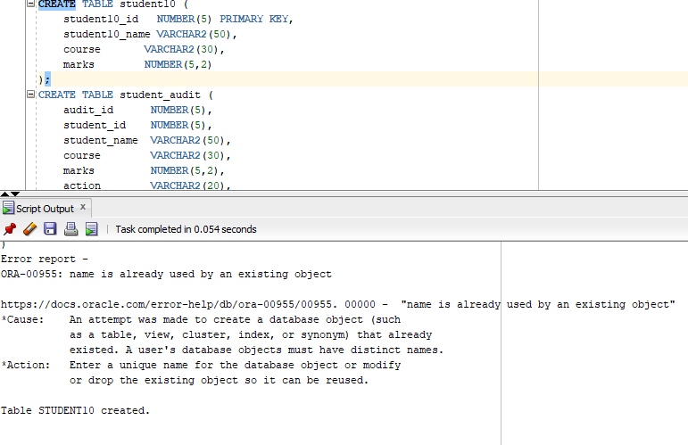

```
CREATE TABLE student10_audit (
    audit_id      NUMBER(5),
    student10_id    NUMBER(5),
    student10_name  VARCHAR2(50),
    course        VARCHAR2(30),
    marks         NUMBER(5,2),
    action        VARCHAR2(20),
    action_date   DATE
);
```
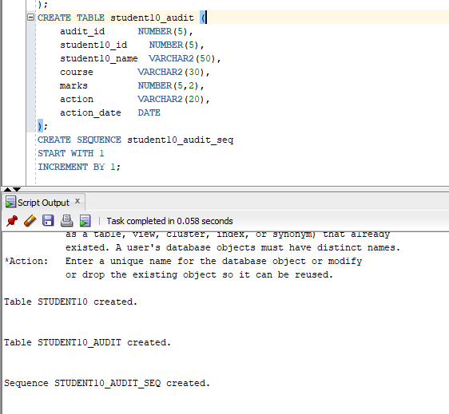

```
CREATE SEQUENCE student10_audit_seq
START WITH 1
INCREMENT BY 1;

CREATE OR REPLACE TRIGGER trg_student10_after_insert
AFTER INSERT ON student10
FOR EACH ROW
BEGIN

    INSERT INTO student10_audit (
        audit_id,
        student10_id,
        student10_name,
        course,
        marks,
        action,
action_date
    )
    VALUES (
        student10_audit_seq.NEXTVAL,
        :NEW.student10_id,
        :NEW.student10_name,
        :NEW.course,
        :NEW.marks,
        'INSERT',
        SYSDATE
    );

END;
/
INSERT INTO student10
VALUES (101, 'Ravi', 'CSE', 85);

COMMIT;
SELECT * FROM student10;
SELECT * FROM student10_audit;

```
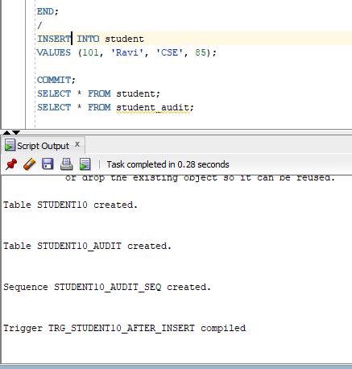
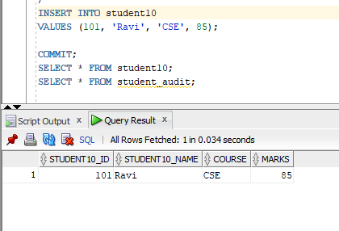
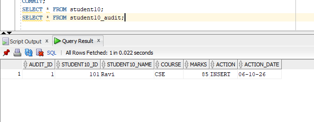


##program no3```
CREATE TABLE employee10 (
    employee10_id   NUMBER(5) PRIMARY KEY,
    employee10_name VARCHAR2(50),
    department    VARCHAR2(30),
    salary        NUMBER(10,2)
);
```
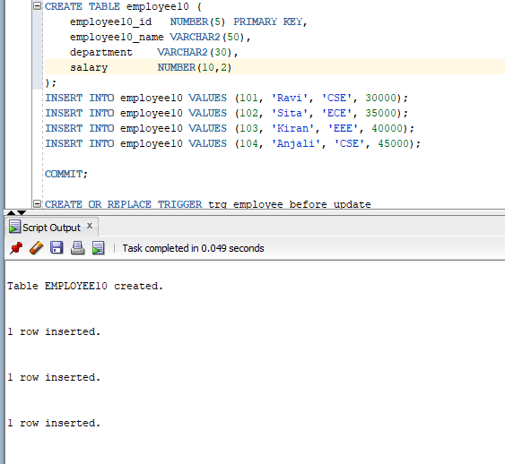

```
INSERT INTO employee10 VALUES (101, 'Ravi', 'CSE', 30000);
INSERT INTO employee10 VALUES (102, 'Sita', 'ECE', 35000);
INSERT INTO employee10 VALUES (103, 'Kiran', 'EEE', 40000);
INSERT INTO employee10 VALUES (104, 'Anjali', 'CSE', 45000);

COMMIT;
```
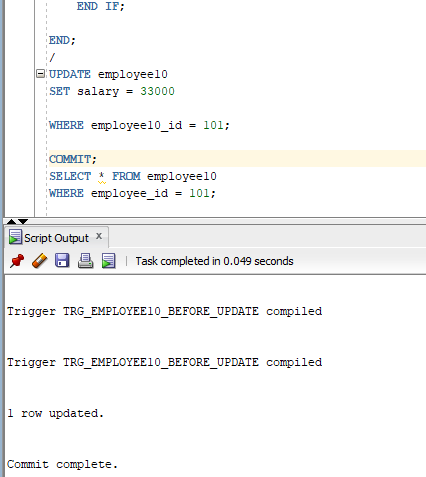

```

CREATE OR REPLACE TRIGGER trg_employee10_before_update
BEFORE UPDATE ON employee10
FOR EACH ROW
BEGIN
  -- Compare old and new salary
    IF :NEW.salary < :OLD.salary THEN

        RAISE_APPLICATION_ERROR(
            -20001,
            'Salary cannot be decreased.'
        );

    END IF;

END;
/
UPDATE employee10
SET salary = 33000

WHERE employee10_id = 101;

COMMIT;
SELECT * FROM employee10
WHERE employee10_id = 101;

UPDATE employee10
SET salary = 28000
WHERE employee10_id = 101;
SELECT * FROM employee10;
```
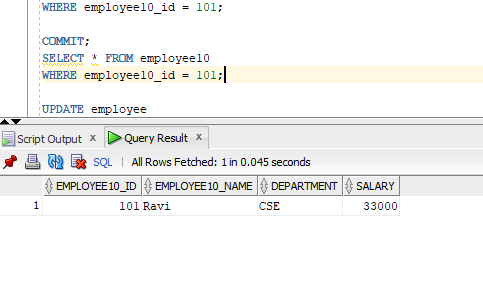
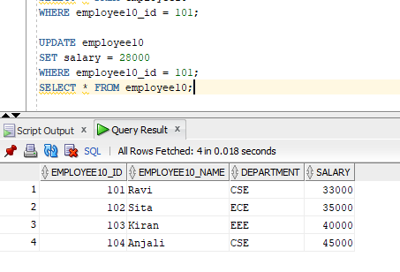

##program no4```
CREATE OR REPLACE TRIGGER trg_employee11_after_delete
AFTER DELETE ON employee11
BEGIN

    INSERT INTO employee11_delete_log (
        log_id,
        message,
        delete_date
    )
    VALUES (
        employee11_delete_log_seq.NEXTVAL,
        'DELETE statement executed on EMPLOYEE11 table.',
        SYSDATE
    );

    DBMS_OUTPUT.PUT_LINE(
        'DELETE statement executed successfully.'
  );

END;
```
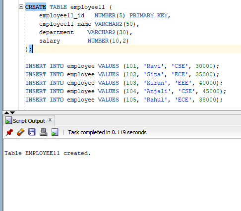
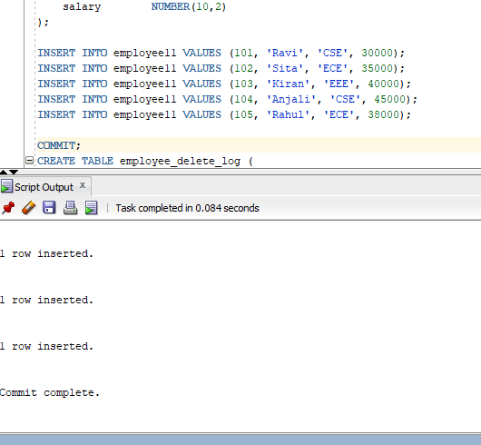
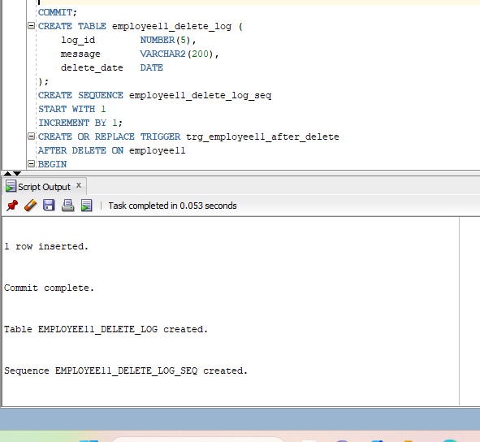


```

SELECT trigger_name, status
FROM user_triggers
WHERE trigger_name = 'TRG_EMPLOYEE_AFTER_DELETE';
SET SERVEROUTPUT ON;

DELETE FROM employee11
WHERE employee11_id = 101;

COMMIT;
SELECT * FROM employee11;
DELETE FROM employee11
WHERE department = 'ECE';

COMMIT;
SELECT * FROM employee11_delete_log;
```
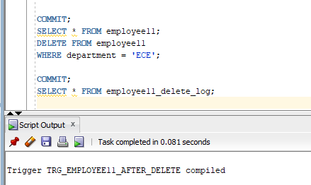

##program no5```
CREATE TABLE course3 (
    course3_id   NUMBER(5) PRIMARY KEY,
    course3_name VARCHAR2(50)
);
```
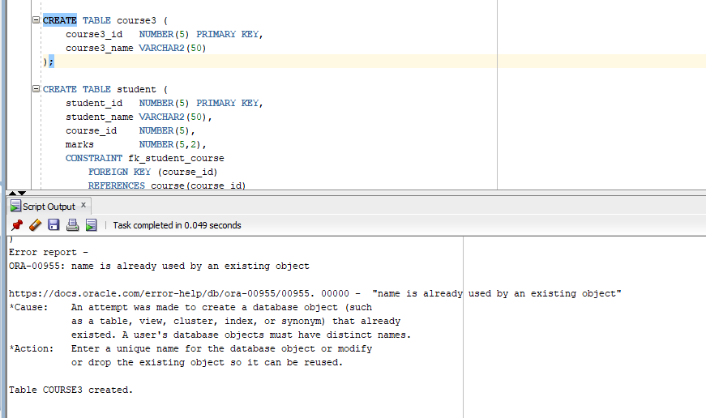

```
CREATE TABLE student12 (
    student12_id   NUMBER(5) PRIMARY KEY,
    student12_name VARCHAR2(50),
    course3_id    NUMBER(5),
    marks        NUMBER(5,2),
    CONSTRAINT fk_student12_course3
        FOREIGN KEY (course3_id)
        REFERENCES course3(course3_id)
);
```
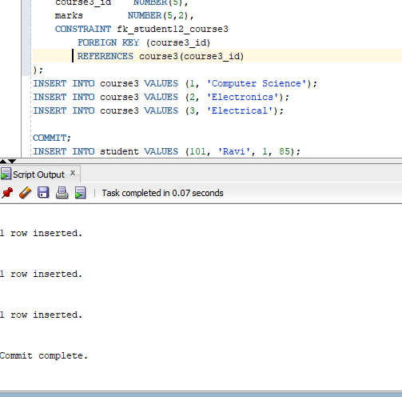

```
INSERT INTO course3 VALUES (1, 'Computer Science');
INSERT INTO course3 VALUES (2, 'Electronics');
INSERT INTO course3 VALUES (3, 'Electrical');

COMMIT;
INSERT INTO student12 VALUES (101, 'Ravi', 1, 85);
INSERT INTO student12 VALUES (102, 'Sita', 2, 90);
INSERT INTO student12 VALUES (103, 'Kiran', 3, 78);
INSERT INTO student12 VALUES (104, 'Anjali', 1, 88);

COMMIT;
CREATE OR REPLACE VIEW student12_course3_view AS
SELECT
    s.student12_id,
    s.student12_name,
    s.course3_id,
    c.course3_name,
    s.marks
FROM student12 s
JOIN course3 c
    ON s.course3_id = c.course3_id;
SELECT * FROM student12_course3_view;

CREATE OR REPLACE TRIGGER trg_student12_view_update
INSTEAD OF UPDATE ON student12_course3_view
FOR EACH ROW
BEGIN

    UPDATE student12
    SET
        student12_name = :NEW.student12_name,
        marks = :NEW.marks
    WHERE student12_id = :OLD.student12_id;

END;
UPDATE student12_course3_view
SET marks = 95
WHERE student12_id = 101;

COMMIT;
SELECT * FROM student12;
SELECT * FROM student12_course3_view;

```
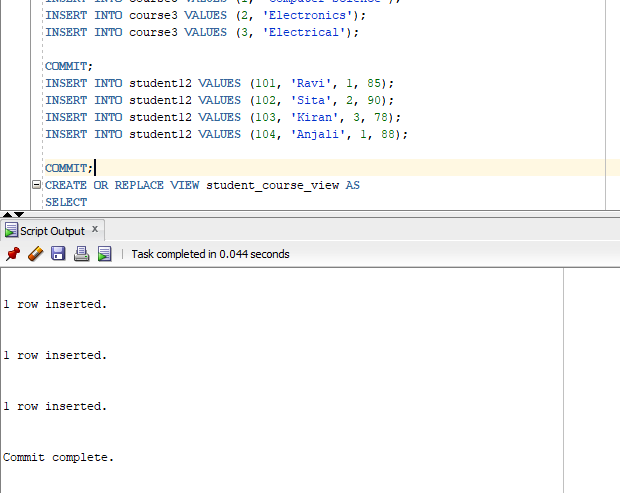
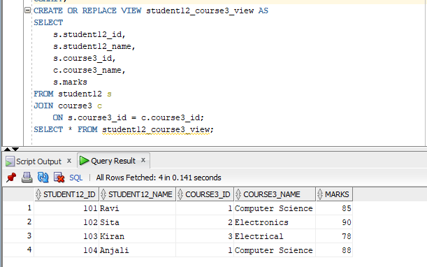
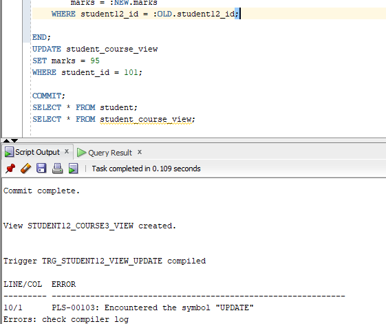
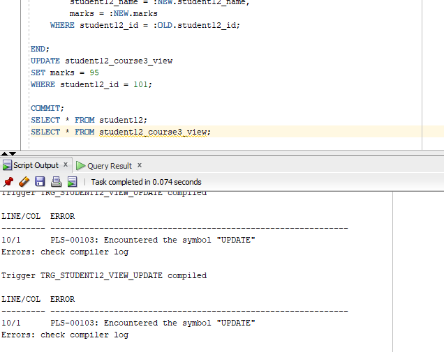


